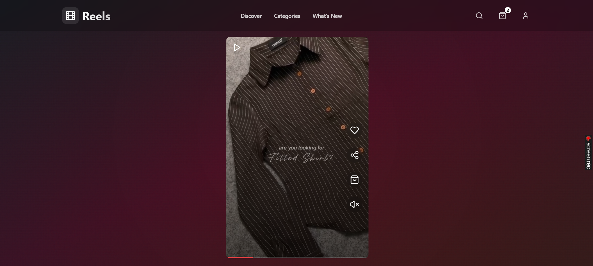

# Reels App



Deployed Link: [arnab-reels.vercel.app](https://arnab-reels.vercel.app/)

## Overview
This project is a dynamic and interactive Reels app. Users can view product videos as reels and navigate to individual product pages by clicking the shopping bag icon on each reel. The design focuses on providing a seamless and engaging shopping experience.

## Thought Process and Design Choices

1. **User Experience**:
   - Designed for simplicity and user engagement.
   - Focused on ensuring smooth navigation from reels to product pages.
   
2. **Responsiveness**:
   - Ensured the app works seamlessly on various screen sizes.

3. **Tech Stack**:
   - **Frontend**: React with Vite for fast builds and development.
   - **Styling**: TailwindCSS for a modern and clean UI.
   - **State Management**: React Query for efficient data fetching and caching.

4. **Animations**:
   - Added subtle animations using Radix UI components to enhance the viewing experience.

## Setup Instructions

Follow these steps to run the project locally:

1. Clone the repository:
   ```bash
   git clone https://github.com/Arnab514/reels.git
   cd reels
   ```

2. Install dependencies:
   ```bash
   npm install
   ```

3. Start the development server:
   ```bash
   npm run dev
   ```

4. Build for production:
   ```bash
   npm run build
   ```

5. Preview the production build:
   ```bash
   npm run preview
   ```

## Known Issues

- **Responsive Behavior**:
  Some UI elements might not render optimally on smaller devices.

- **Performance**:
  Video loading might take slightly longer on slower networks.

## Future Improvements

1. **Enhanced Video Optimization**:
   - Implement lazy loading and video compression for faster load times.

2. **User Profiles**:
   - Add user accounts to save favorite reels and track shopping history.

3. **Search and Filters**:
   - Enable searching and filtering by product categories or tags.

4. **Improved Accessibility**:
   - Add ARIA attributes for better accessibility.

5. **Testing**:
   - Include comprehensive unit and integration tests to ensure app stability.

## Contribution
Feel free to fork this repository and contribute by opening issues or submitting pull requests.

## License
This project is licensed under the MIT License.

---

For more details, check the [GitHub Repository](https://github.com/Arnab514/reels).

